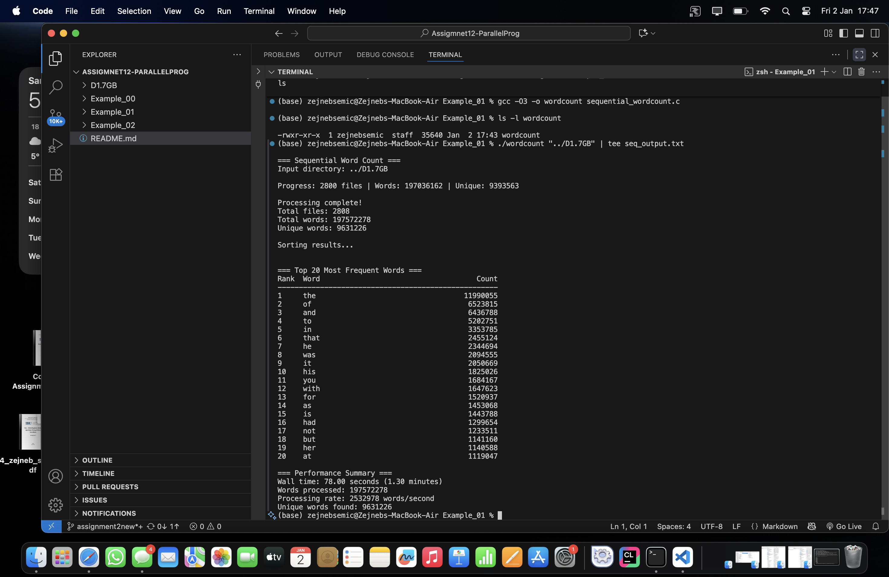
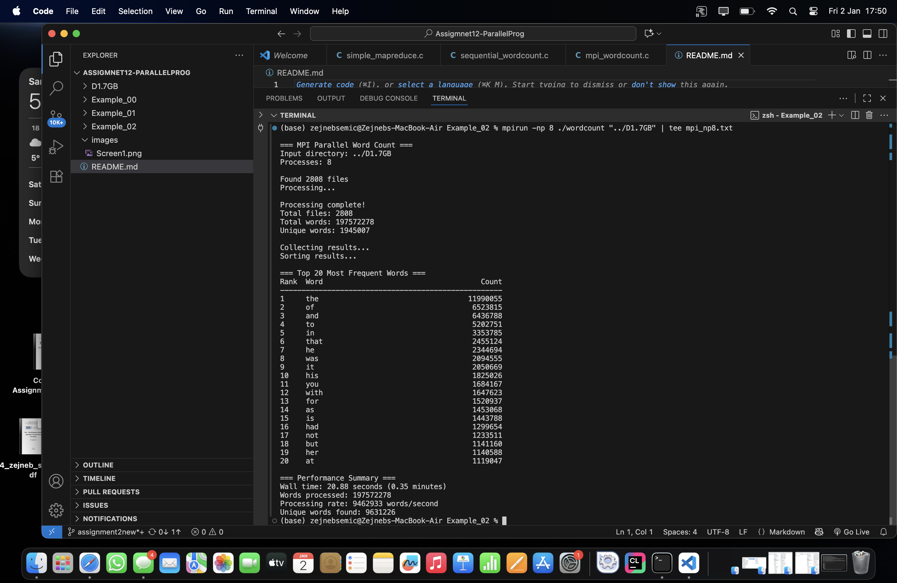
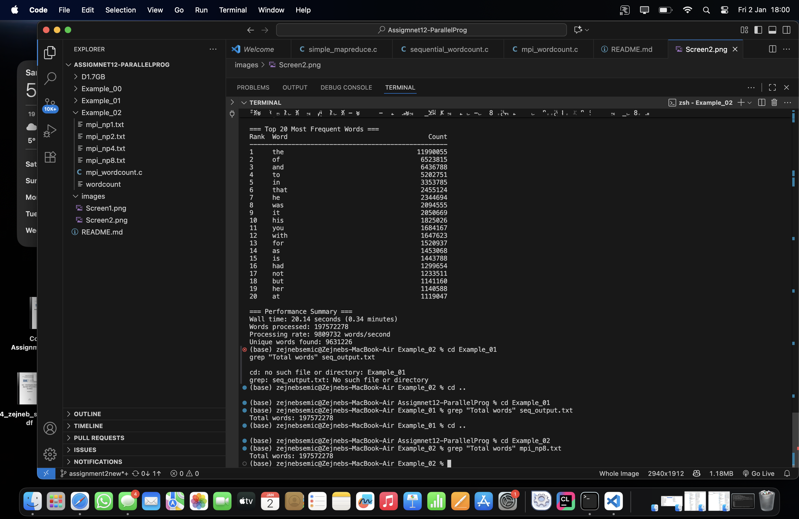

This assignment was focused on practicing the MapReduce concept by implementing and comparing a sequential and a parallel word counting program using MPI. 
For this task, I used the provided real-world dataset located in the D1.7GB folder. The dataset contains 2808 .txt files, each containing text from different literature sources. The same dataset was used for all executions to ensure consistency and a fair comparison between sequential and parallel approaches.

I first worked with the sequential implementation located in the Example_01 folder. The program was compiled using the gcc -O3 optimization flag, which enables compiler optimizations for better performance. After compilation, the generated executable was verified using ls -l to confirm that it was successfully created. The program was then executed from the terminal using the dataset path as input.
During execution, the program reported progress in the terminal, showing how many files had been processed and how many words had been counted so far. After completion, the terminal output confirmed that all 2808 files were processed. The sequential implementation counted a total of 197,572,278 words, with 9,631,226 unique words. The final performance summary reported a total wall time of 78.00 seconds, which corresponds to a processing rate of 2,532,978 words per second. The program also printed the top 20 most frequent words, such as “the”, “of”, “and”, and “to”, along with their exact counts.

After completing the sequential run, I moved to the parallel MPI implementation located in the Example_02 folder. This version was compiled using mpicc -O3, which links the program with MPI libraries and applies compiler optimizations. The generated executable was again verified from the terminal before execution.
The MPI program was first executed using 8 processes with the mpirun -np 8 command. The terminal output showed that process rank 0 successfully found all 2808 files and distributed them among the available processes. Each process handled a subset of files and performed local word counting. After processing, the results were collected and merged on rank 0. The terminal confirmed that the total number of words was 197,572,278, exactly matching the sequential result. The execution time for this run was 20.14 seconds, which is significantly faster than the sequential execution. The processing rate increased to approximately 9,809,732 words per second, clearly demonstrating the benefit of parallel execution.

Then I ran the MPI implementation with different numbers of processes: 1, 2, 4 and 8. When running with 1 MPI process, the execution time was 88.27 seconds, which is slower than the sequential version. This slowdown is expected and is caused by MPI initialization and communication overhead. When running with 2 processes, the execution time decreased to 39.25 seconds. With 4 processes, the time was further reduced to 27.49 seconds and with 8 processes, the execution reached its best performance at 20.14 seconds. These results show a clear performance improvement as the number of processes increases, although the speedup is not perfectly linear due to synchronization and communication costs between processes.

Correctness of the parallel implementation was approved directly from the terminal. Using the command grep "Total words" on the output files generated by both the sequential and MPI executions, I confirmed that the total word count was identical in both cases. Additionally, the top 20 most frequent words and their counts were the same across all runs, confirming that the parallel version produces correct and consistent results.

Both implementations use a hash-based approach for the shuffle and grouping phase. Although sorting can sometimes benefit from better cache locality, for large datasets like this one, the hash-based approach is more efficient and provides better overall performance.
In conclusion, the results obtained directly from terminal executions clearly show that MPI-based parallelization significantly improves performance for large-scale word counting tasks. While the sequential implementation is simpler and easier to understand, the parallel implementation drastically reduces execution time while preserving correctness.