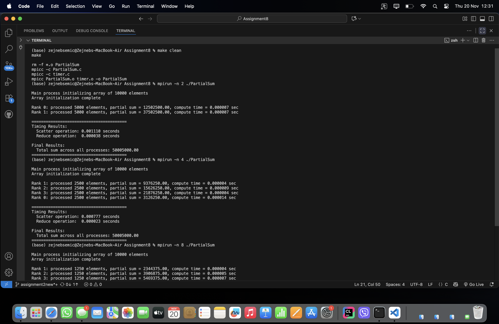
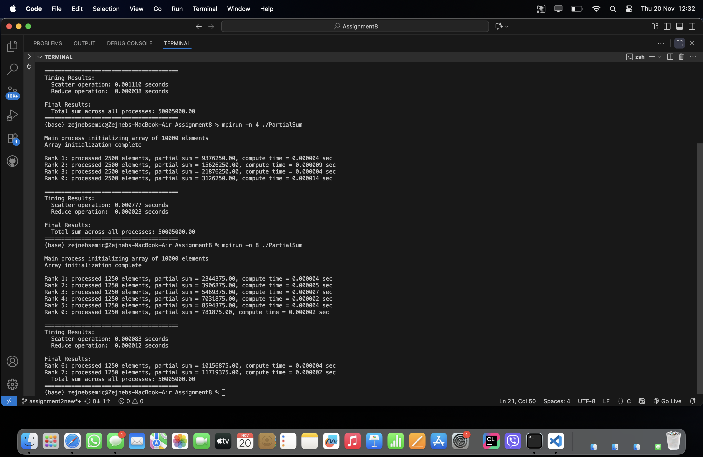

In this assignment, I had to complete a piece of code that uses MPI collective functions to calculate the sum of the elements of an array. The array is created by process 0, and then it is shared among all processes. My task was to fill in the parts of the code that are marked in comments.
At the beginning, process 0 creates an array and fills it with the value 1: 
    if (rank == 0) {
    array = (int*)malloc(size_of_array * sizeof(int));
    for (int i = 0; i < size_of_array; i++) array[i] = 1;
}

To let all processes know how big the array is, I first sent the size_of_array to everyone using MPI_Bcast:
    MPI_Bcast(&size_of_array, 1, MPI_INT, 0, MPI_COMM_WORLD);

Then I calculated how many elements each process gets:
    int local_size = size_of_array / world_size;
    int* local_array = (int*)malloc(local_size * sizeof(int));

I did the string splitting with MPI_Scatter, where process 0 sends its string, and the other processes receive their parts:
    MPI_Scatter(array, local_size, MPI_INT,
            local_array, local_size, MPI_INT,
            0, MPI_COMM_WORLD);

Each process then calculates its sum:
    int local_sum = 0;
    for (int i = 0; i < local_size; i++) local_sum += local_array[i];

To collapse all local sums into one, I used MPI_Reduce:
    MPI_Reduce(&local_sum, &global_sum, 1, MPI_INT, MPI_SUM, 0, MPI_COMM_WORLD);

After completing the code, I ran it with 2, 4 and 8 processes using the mpirun command. I ran the code like this mpirun -n 2 ./PartialSum
mpirun -n 4 ./PartialSum
mpirun -n 8 ./PartialSum

- mpirun -n 2 ./PartialSum : When I ran the program with 2 processes, process 0 created an array and split it into two parts, so that each process got 5000 elements. The program printed out which rank processed which part, the partial sums, the calculation time, and the duration of the Scatter and Reduce operations. The result was: Rank 0 processed 5000 elements and had a partial sum of 12502500.00, and Rank 1 also processed 5000 elements with a partial sum of 37502500.00. The Scatter operation took 0.001110 seconds, the Reduce took 0.000038 seconds, and the total sum was 50005000.00

- mpirun -n 4 ./PartialSum : When I ran the program with 4 processes, the array was divided into 4 equal parts of 2500 elements each. All processes calculated their partial sums and printed them: Rank 1 had 9376250.00, Rank 2 – 15626250.00, Rank 3 – 21876250.00, and Rank 0 – 3126250.00. The time of the Scatter operation was 0.000777 seconds, and Reduce 0.000023 seconds. The total sum was again 50005000.00. Scatter worked faster here than with 2 processes, which is expected because smaller parts of the array are sent.

- mpirun -n 8 ./PartialSum : Starting with 8 processes, the array was divided into 8 parts, 1250 elements each. All processes showed their partial sums: Rank 1 – 2344375, Rank 2 – 3906875, Rank 3 – 5469375, Rank 4 – 7031875, Rank 5 – 8594375, Rank 0 – 781875, Rank 6 – 10156875 and Rank 7 – 11719375. Scatter took only 0.000083 seconds and Reduce 0.000012 seconds. The total amount was the same as before – 50005000.

I noticed that Scatter time decreases as the number of processes increases, because each process gets a smaller segment of the array, so the division is done faster. Reduce is also faster when there are more processes, because smaller partial sums are combined. In the end, the code works correctly with 2, 4, and 8 processes, the total sum is always correct, and the results clearly show how collective MPI functions work and how execution speeds up when the task is divided across multiple processes.

Screenshots of the terminal:

