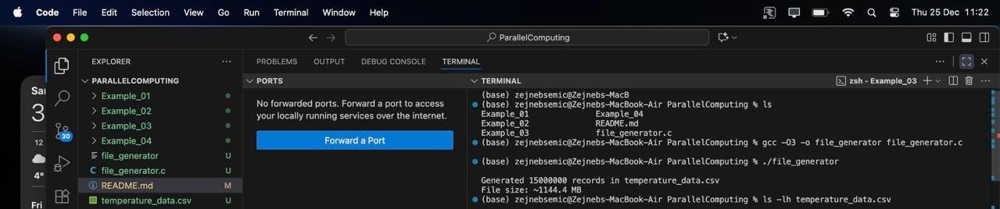
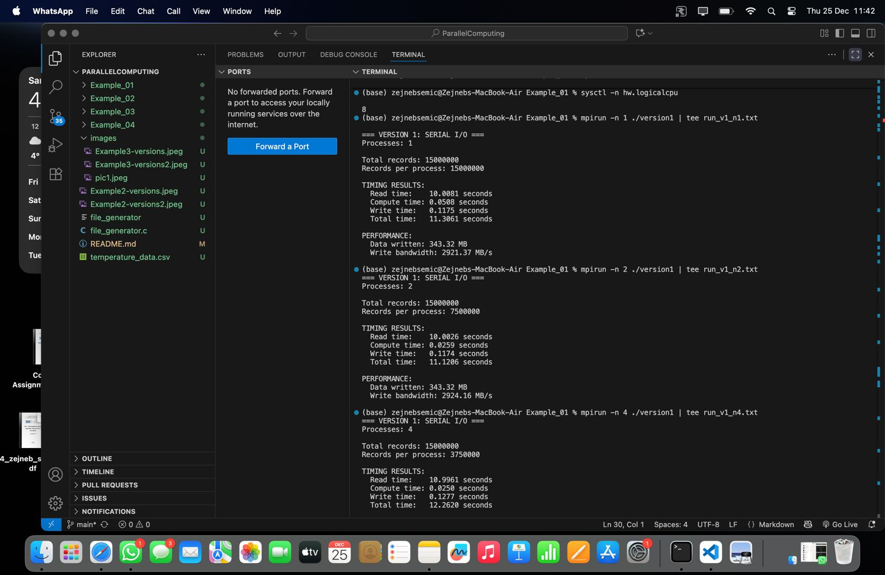
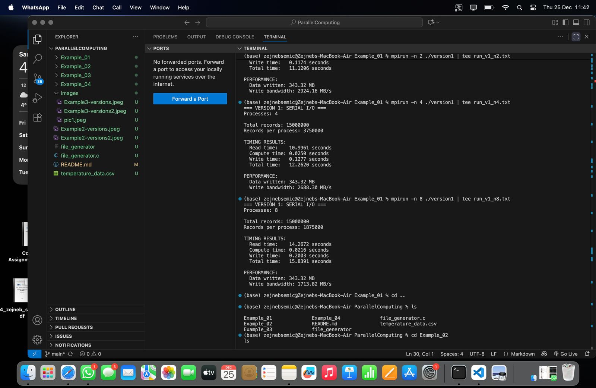
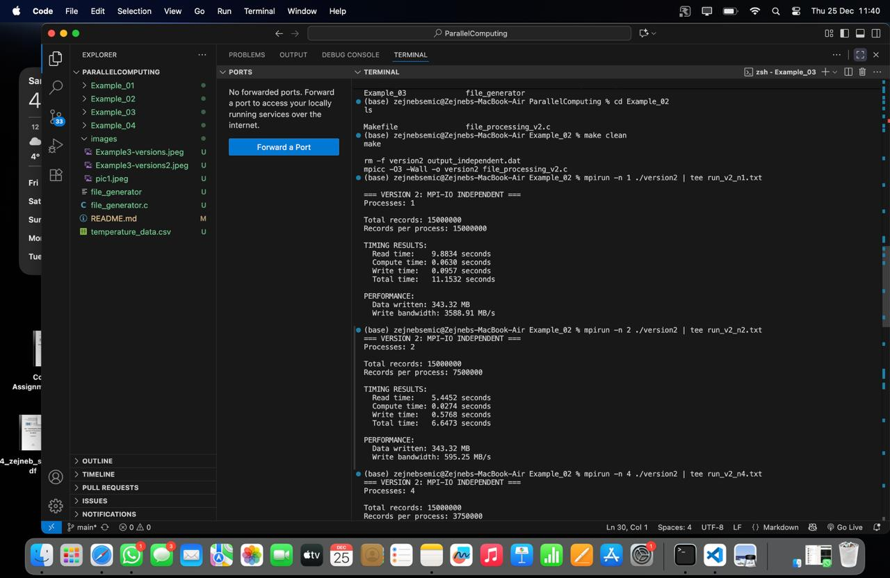
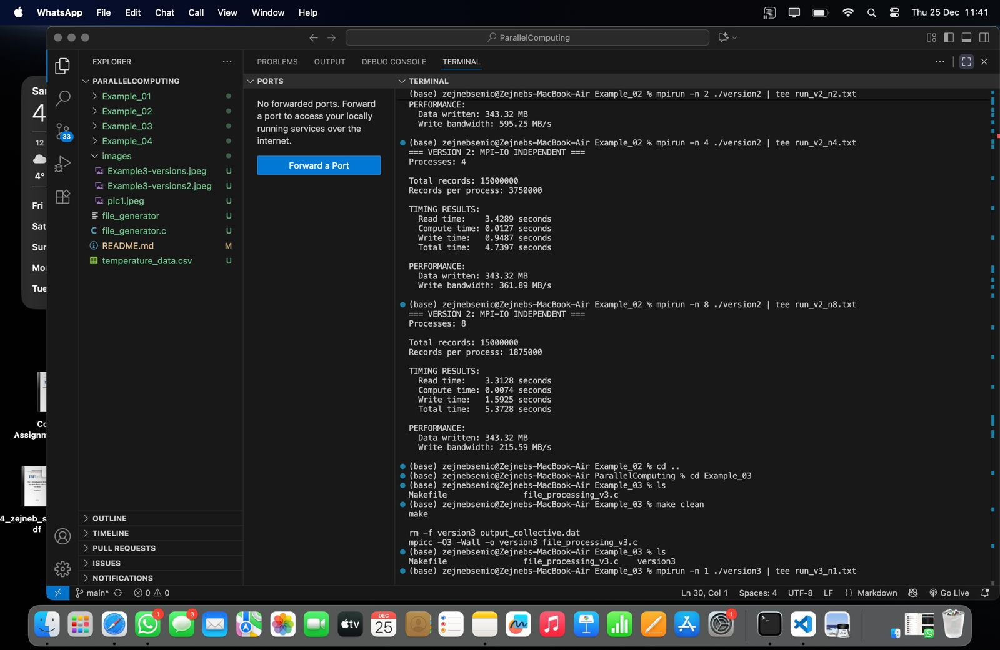
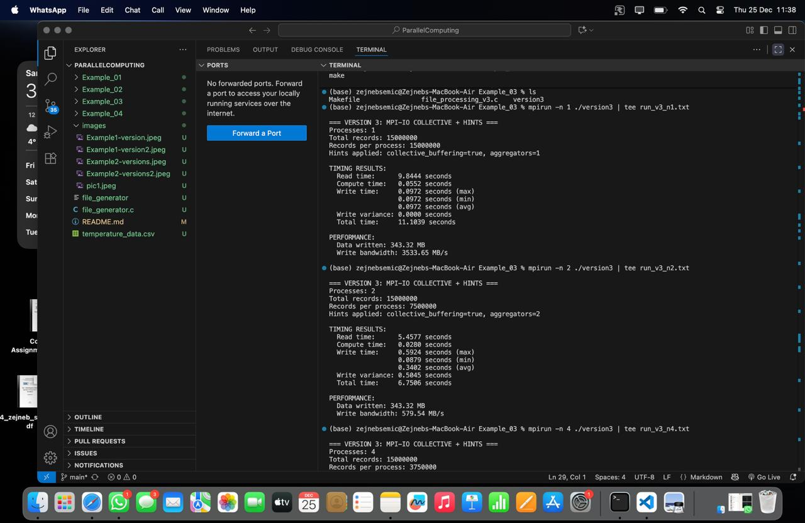
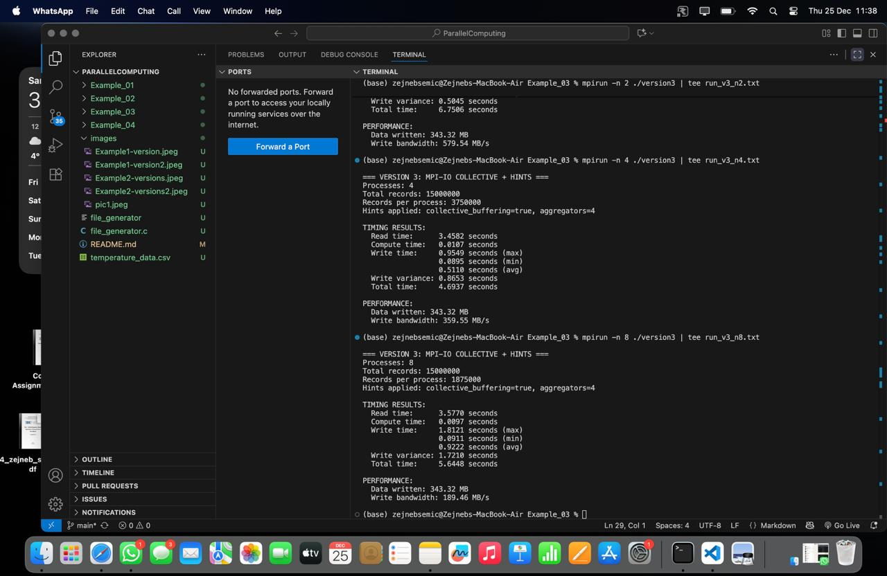

# ParallelComputing

I cloned the provided GitHub repository and ran all examples on my local machine in order to understand different approaches to file processing and the importance of parallelizing file I/O operations. The machine used for testing has 8 logical CPU cores, which was the maximum number of MPI processes used during execution.

Before running any of the examples, I generated the dataset using the provided file_generator.c implementation. The generator was compiled and executed without any CLI arguments, which produced a large dataset suitable for realistic performance testing. The generated file was named temperature_data.csv, contained 15,000,000 records, and had a size of approximately 880 MB. The file was placed in the root directory of the project, which is required since all examples expect the input file to be located there.

After generating the dataset, I executed Example_01, Example_02 and Example_03 using 1, 2, 4 and 8 MPI processes.
In Example_01, the program uses serial file I/O. Only rank 0 opens and reads the entire CSV file, stores all data in memory. Then distributes the data to other processes using MPI_Scatter. After computation, all results are gathered back to rank 0 using MPI_Gather and rank 0 alone writes the output file. This creates a clear bottleneck. The results show that increasing the number of processes does not improve performance. With 1 process, the total execution time was about 11.3 seconds. With 2 processes, it was about 11.1 seconds. With 4 processes, it increased to about 12.3 seconds, and with 8 processes it increased further to about 15.8 seconds. The read time dominates the execution and even increases as more processes are added, showing that serial I/O and rank 0 communication overhead limit scalability.

In Example_02, MPI-IO with independent file operations is used. Each process opens the input file, skips to its assigned portion and reads only its own data. For output, each process writes directly to its own region of the output file using MPI_File_write_at, without gathering data on a single process. This significantly reduces the bottleneck seen in Example_01. The results show much better scaling. With 1 process, the total time was about 11.15 seconds, similar to Example_01. However, with 2 processes the total time dropped to about 6.65 seconds, with 4 processes it dropped to about 4.74 seconds and with 8 processes it was about 5.37 seconds. This demonstrates that parallelizing file I/O operations leads to a substantial improvement in execution time.

In Example_03, collective MPI-IO operations with performance hints are used. Similar to Example_02, each process handles its own portion of the data, but writing is performed using collective operations (MPI_File_write_all) together with MPI file views. Additional MPI hints such as collective_buffering, cb_buffer_size and a limited number of aggregators are applied. These hints allow MPI to group I/O operations and reduce filesystem contention by having only a subset of processes communicate directly with the filesystem.
The results of Example_03 are comparable to those of Example_02. With 1 process, the total execution time was about 11.10 seconds. With 2 processes, it was about 6.75 seconds. With 4 processes, it was about 4.69 seconds and with 8 processes, it was about 5.64 seconds. While Example_03 is slightly faster than Example_02 at 4 processes, Example_02 performs better at 8 processes on this system. This happens because collective MPI-IO introduces additional synchronization and coordination overhead, which can outweigh its benefits on a small system like a laptop with a limited number of cores and a local filesystem.

Despite this, Example_03 provides important improvements in terms of stability and scalability. The output shows write time minimum, maximum and average values as well as write variance. Collective buffering and aggregators reduce I/O contention and lead to more predictable performance, which becomes especially important on large-scale systems with many processes and shared parallel filesystems such as Lustre or GPFS. In such environments, Example_03 would be more suitable than Example_02, even if it does not always appear faster on a small local machine.

The drastic performance difference between Example_01 and Example_02/Example_03 is caused by the fact that Example_01 relies on serial I/O and centralizes all file operations on rank 0. This results in memory, communication and I/O bottlenecks that prevent scalability. In contrast, Example_02 and Example_03 distribute both computation and file access across all processes, which significantly reduces execution time and improves parallel efficiency.