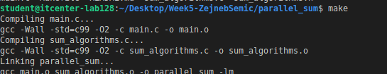
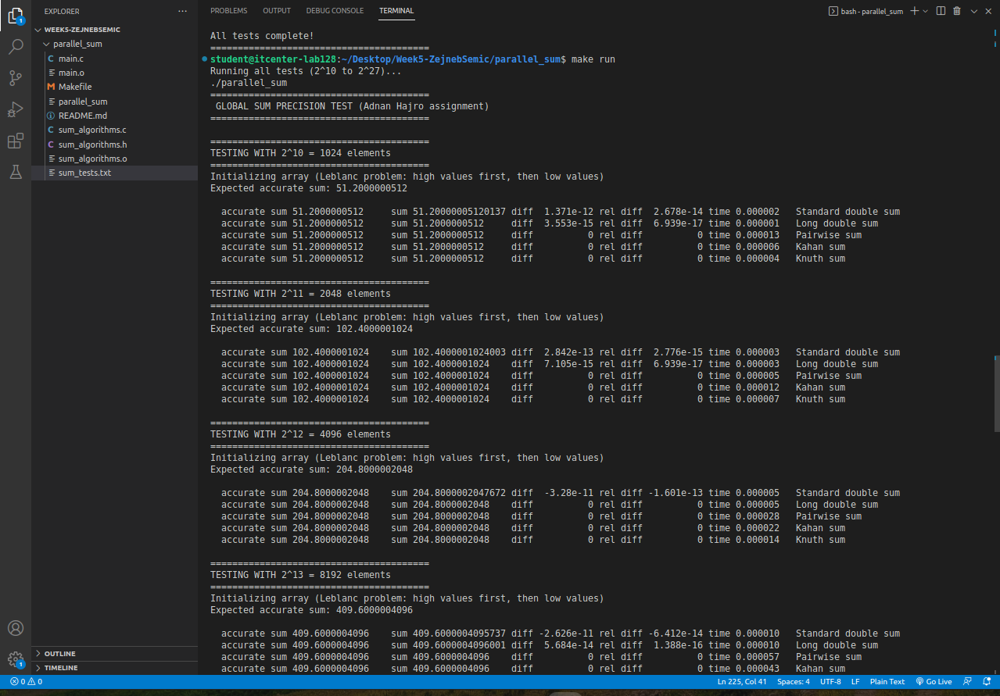

In this assignment, I wrote a C program to add numbers in different ways and compare them. The program tests five methods: standard double, long double, pairwise, Kahan and Knuth summation. I used arrays that get bigger from 2^10 to 2^27 elements. Each method adds the same numbers but gives slightly different results and takes different amounts of time. I also measured the runtime of each method to see how performance changes with array size. The program prints the expected accurate sum, the calculated sum, the difference and the relative error for each method.

To organize my work, I created a folder structure on my computer with separate folders for the assignment. I followed the course repository to make sure I had the correct files and structure. All source files (main.c, sum_algorithms.c) and headers (sum_algorithms.h) are placed in the folder, and I used a Makefile to compile and run the program easily. This setup allowed me to test the program for different array sizes and quickly rebuild or clean the project when needed.

I used make to compile the program and make run to execute it. This way, I could see the results for all array sizes and check both the sum accuracy and the runtime of each method.
Here are screenshots I needed to sumbit:

Link for sheet: https://docs.google.com/spreadsheets/d/1nVfxwy5KK0HWy_y5ZpqcGNuypA2VkcBItTwwhE3o2UY/edit?usp=sharing