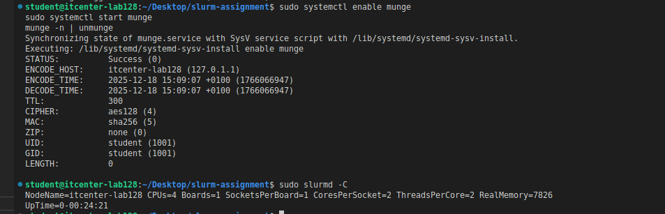
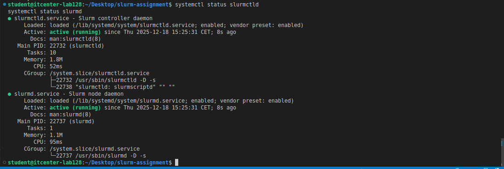
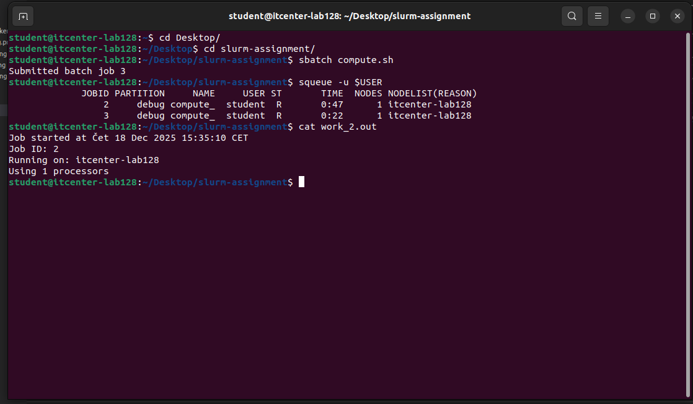

ASSIGMNMENT 10

For this assignment, I installed and configured the Slurm workload manager on a single-node Linux system. I performed all steps necessary to set up the Slurm environment, run batch jobs, and monitor their execution.

First, I installed the required packages using apt-get:
sudo apt-get update
sudo apt-get install -y slurm-wlm slurm-wlm-basic-plugins munge libmunge-dev

After installation, I enabled and started the MUNGE service for authentication:
sudo systemctl enable munge
sudo systemctl start munge
munge -n | unmunge

The output verified that MUNGE was running correctly and able to encode and decode credentials.

Next, I gathered system information using:

sudo slurmd -C
hostname
This gave me the node configuration:
NodeName=itcenter-lab128 CPUs=4 Boards=1 SocketsPerBoard=1 CoresPerSocket=2 ThreadsPerCore=2 RealMemory=7826

I then edited the Slurm configuration file /etc/slurm/slurm.conf, updating the host and node details with my system information. After creating the necessary directories for Slurm state and logs, I started the Slurm daemons:

sudo systemctl restart slurmctld
sudo systemctl restart slurmd

I verified that both slurmctld and slurmd were active and running.

Next, I prepared two batch scripts, compute.sh and overload.sh, and made them executable using:

chmod +x compute.sh
chmod +x overload.sh

The compute.sh script runs a small computation using 4 parallel processes, and the overload.sh script runs a stress test on a single CPU core.

I submitted the compute.sh script using sbatch: sbatch compute.sh

The job was submitted successfully and assigned a job ID. I monitored the job queue using: squeue -u $USER

For example, after submitting multiple jobs, the queue looked like this:

 JOBID PARTITION     NAME     USER ST       TIME  NODES NODELIST(REASON)
     1     debug compute_  student  R       3:27      1 itcenter-lab128
     2     debug compute_  student  R       0:47      1 itcenter-lab128
     3     debug compute_  student  R       0:22      1 itcenter-lab128

While the jobs were running, I monitored system resources with top, which showed the CPU and memory usage of all running processes, including the batch jobs (bc processes) and Slurm daemons: %Cpu(s): 86.7 us, 13.3 sy, 0.0 id
MiB Mem : 7826,7 total, 490,6 free, 3789,7 used, 3546,5 buff/cache

Each job produced an output file, for example:

work_1.out
Job started at Čet 18 Dec 2025 15:27:43 CET
Job ID: 1
Running on: itcenter-lab128
Using 1 processors
slurmstepd-itcenter-lab128: error: *** JOB 1 ON itcenter-lab128 CANCELLED AT 2025-12-18T15:33:01 DUE TO TIME LIMIT ***

work_2.out
Job started at Čet 18 Dec 2025 15:35:10 CET
Job ID: 2
Running on: itcenter-lab128
Using 1 processors
slurmstepd-itcenter-lab128: error: *** JOB 2 ON itcenter-lab128 CANCELLED AT 2025-12-18T15:40:31 DUE TO TIME LIMIT ***

work_3.out
Job started at Čet 18 Dec 2025 15:35:35 CET
Job ID: 3
Running on: itcenter-lab128
Using 1 processors
slurmstepd-itcenter-lab128: error: *** JOB 3 ON itcenter-lab128 CANCELLED AT 2025-12-18T15:41:01 DUE TO TIME LIMIT ***

I ran the compute.sh script multiple times (3-4 runs) to satisfy the assignment requirements. For each run, I saved the output files (work_1.out, work_2.out, work_3.out), took screenshots of squeue to show the job queue, and top to show CPU usage. This demonstrates Slurm’s job scheduling, resource allocation, and handling of multiple simultaneous jobs.

Job queue on batch job 3: 

Top showing CPU usage on batch job 2:

