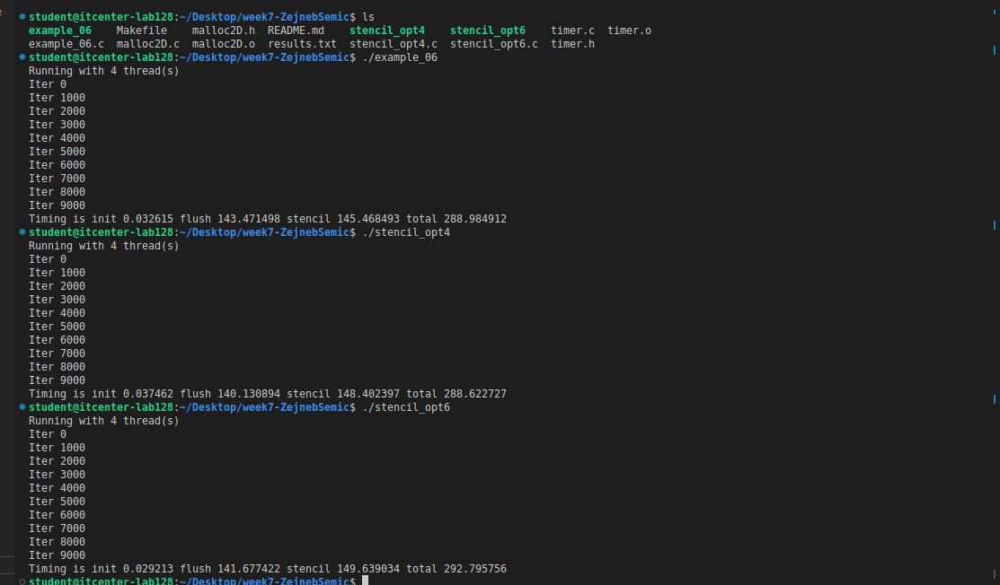

OpenMP Stencil Optimization

In this task, we compared three different OpenMP implementations of a 2D stencil program:example_06.c (or stencil_opt2.c)
,stencil_opt4.c and stencil_opt6.c. The goal was to test and understand how different OpenMP strategies affect performance and execution time.
The results of the programs were as you can in the screenshot provided at the end of README.md. For example_06 the initialization time was 0.032615 seconds, flush time 143.471498 seconds, stencil computation 145.468493 seconds and total time 288.984912 seconds. For stencil_opt4 initialization took 0.037462 seconds, flush 140.130894 seconds, stencil 148.402397 seconds and total 288.622727 seconds. For stencil_opt6 initialization was 0.029213 seconds, flush 141.677422 seconds, stencil 149.639034 seconds and total 292.795756 seconds.

All programs were compiled with gcc using OpenMP (-fopenmp) and ran on my CPU using 4 threads, as you can see from the message Running with 4 thread(s).
The code was made faster by improving parallel parts and reducing waiting between threads. Loops were shared better between threads. Some improvements were combining small parallel sections into bigger ones, using nowait to skip waiting and also dividing work manually in stencil_opt6. 
Implicit barriers happen automatically at the end of loops making all threads wait. Explicit barriers are written with #pragma omp barrier to make threads wait at specific points. In these programs, example_06 used only implicit barriers, stencil_opt4 used nowait to skip some waiting and stencil_opt6 used explicit barriers. Barriers make sure threads work correctly.
All programs give the same results, but stencil_opt4 and stencil_opt6 are a bit faster because they reduce waiting and use threads better.

Answers to questions: 
1. How many threads your CPU used to execute the code? 
- My CPU used four threads to execute the code.
2.What are the parts of the code that were improved? 
- The parallel loops and thread synchronization were improved.
3. What strategies were used to improve the code? 
- The strategies included combining small parallel regions into bigger ones, using nowait to avoid unnecessary waiting and distributing work manually between threads.
4. What is the difference between explicit and implicit barriers?
- Implicit barriers happen automatically at the end of parallel loops, making all threads wait. Explicit barriers are manually written in the code to make threads wait at specific points.
5. Did they exist in these examples?
- In these examples, example_06 used only implicit barriers, stencil_opt4 used nowait to remove some implicit barriers and stencil_opt6 used explicit barriers to control synchronization.
6. What do they mean?
- Barriers ensure threads finish work at the right time and avoid errors.

